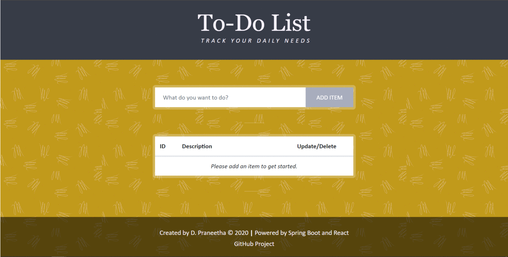

# Basic To-Do Application
A *REST* based *Spring* to-do application with basic functionalities - *create* item, *delete* item, *update* item, *find* item by ID and *retrieve* all items. Uses *MySQL* database connection and *Postman* for verifying the requests. 
Includes unit and integration tests for every functionality. Testing is done using the in-memory database *H2*.
Contains user interface created by *ReactJS*.

## Application Structure
### todo/src/main/java
Contains the general model, controller, service and repository folders under the package **com.practice.todo**.

### todo/src/test/java
Contains **integration** and **unit** test folders under the package **com.practice.todo**. The **unit** folder further contains folders for testing controller, service and repository functionalities respectively.

### ui/
Contains code for **ReactJs** based user interface. Refer to *ReadMe.md* file inside this folder for further instructions.

## MySQL Database Connection Setup
The database *name*, *username* and *password* can be changed in the **todo/src/main/resources/application.properties** file based on  preference. 
 
## H2 Connection Setup
Configuration details are present in the **todo/src/test/resources/application-test.properties** file and can be changed based on preference.

## Postman for Verifying the Connection
Uses Postman to perform *GET*, *POST*, *PUT* and *DELETE* requests, and checks if the changes are reflected in the database respectively. Check by logging in as the user and by using the database specified during the MySQL connection setup while performing the requests through *Postman*.

## Running The Application 
- Start MySQL database.
- Run the Spring Boot project from IDE.
- Install the required node modules and run the React project.

The application should open in the default browser.

 

